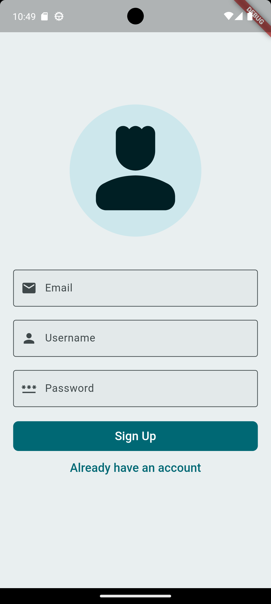
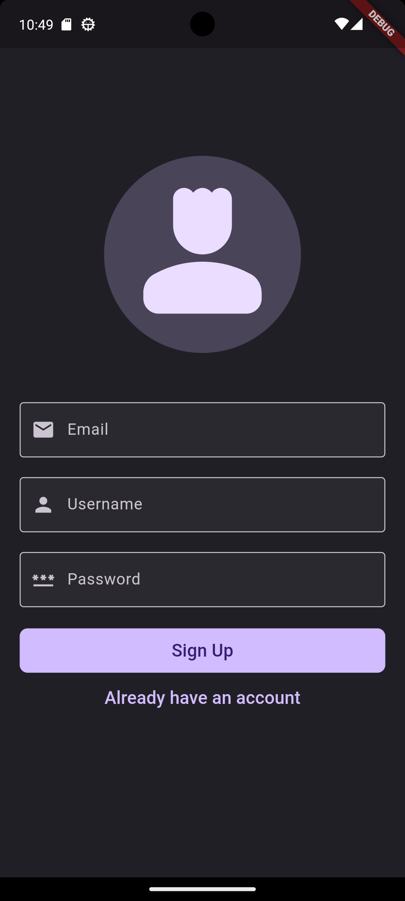
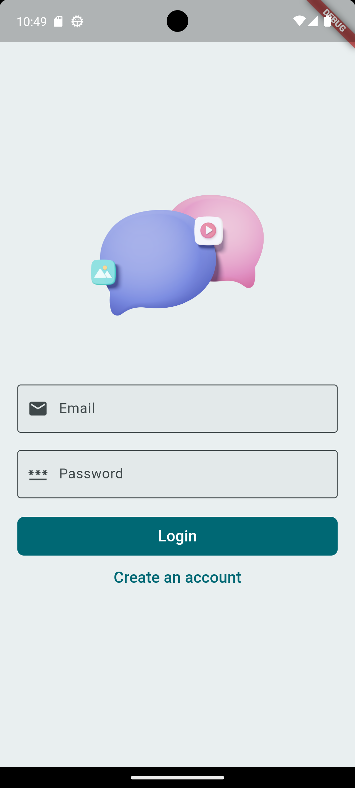
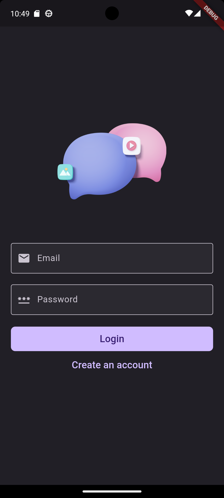
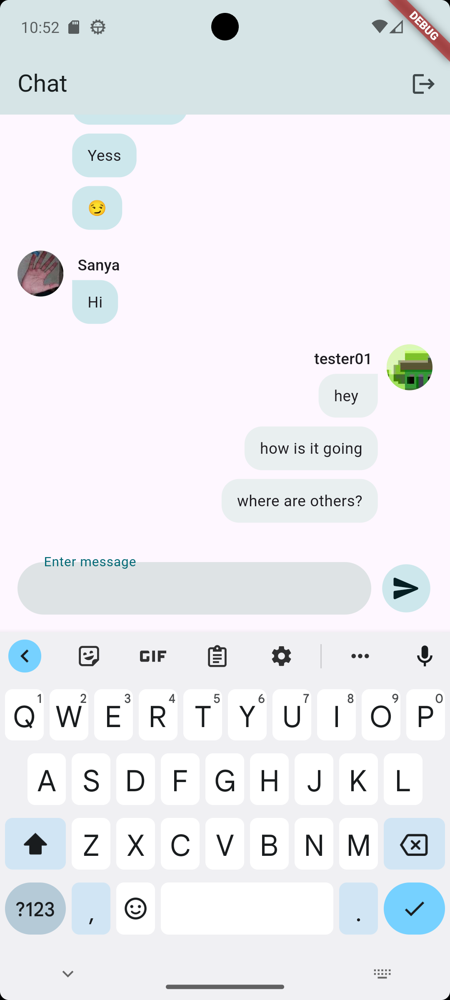
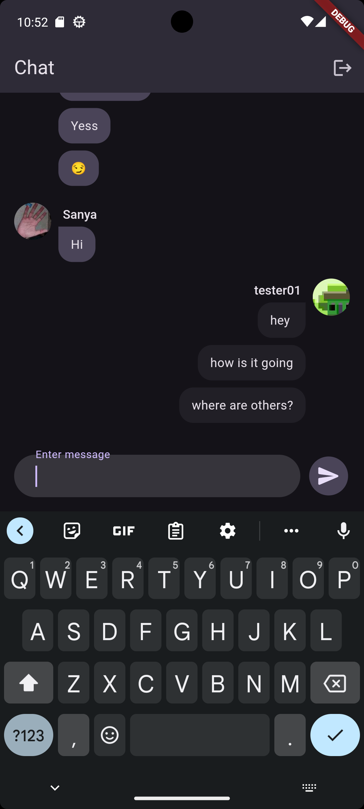

# Chat App

A simple chat application built with Flutter and Firebase.

## Features

- User authentication with Firebase
- Real-time messaging
- Send and receive messages
- Logout functionality

## Getting Started

### Prerequisites

- Flutter SDK: [Install Flutter](https://flutter.dev/docs/get-started/install)
- Firebase account: [Create Firebase Project](https://firebase.google.com/)

### Installation

1. Clone the repository:
    ```sh
    git clone https://github.com/hirdeshx01/chat_app.git
    cd chat_app
    ```

2. Install dependencies:
    ```sh
    flutter pub get
    ```

3. Set up Firebase:
    - Follow the instructions to add Firebase to your Flutter app: [Add Firebase to your Flutter app](https://firebase.google.com/docs/flutter/setup)

4. Run the app:
    ```sh
    flutter run
    ```

## Usage

- Open the app and sign up with an email.
- Start sending and receiving messages in real-time.

## Screenshots

Here are some screenshots of the application:

### Signup Screen
<div style="display: flex; gap: 20px;">
    
    
</div>

### Login Screen
<div style="display: flex; gap: 20px;">
    
    
</div>

### Chat Screen
<div style="display: flex; gap: 20px;">
    
    
</div>


## Contributing

Contributions are welcome! Please feel free to submit a Pull Request.
